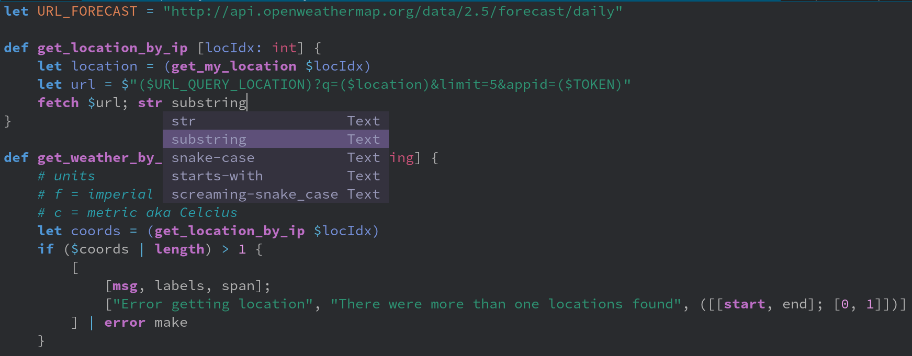

# nvim-nu - Basic editor support for the nushell language



---

**Warning: This is WIP! The highlighting, nor folding are perfect. PR's are welcome**

---

### Table of contents

* [Requirements](#requirements)
* [Installation](#installation)
---

# Requirements

- Neovim [nightly](https://github.com/neovim/neovim#install-from-source)
- A [nu](https://github.com/nushell/nushell/releases) binary in your path
- A C compiler in your path and libstdc++ installed ([Windows users please read this!](https://github.com/nvim-treesitter/nvim-treesitter/wiki/Windows-support)).
- [nvim-treesitter](https://github.com/nvim-treesitter/nvim-treesitter/blob/master/README.md#quickstart) installed

# Installation

You can install `nvim-nu` with your favorite package manager (or using the native `package` feature of vim, see `:h packages`).

E.g., if you are using [vim-plug](https://github.com/junegunn/vim-plug), put this in your `init.vim` file:

```vim
Plug 'LhKipp/nvim-nu', {'do': ':TSInstall nu'}
```


